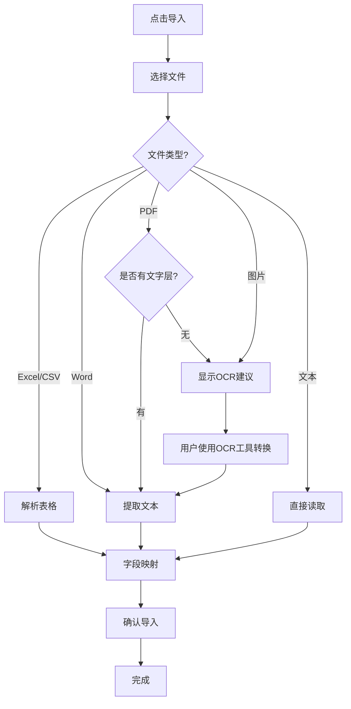

# 文件格式支持完成总结

## ✅ 已完成的工作

### 1. 支持的文件格式

| 格式 | 扩展名 | 状态 | 说明 |
|------|--------|------|------|
| Excel | `.xlsx`, `.xls`, `.csv` | ✅ 完美支持 | 原有功能 |
| **Word** | `.docx` | ✅ **新增** | 使用mammoth.js |
| PDF（有文字层） | `.pdf` | ✅ 完美支持 | 快速文本提取 |
| PDF（扫描件） | `.pdf` | ⚠️ 需要OCR | 检测并提示 |
| 图片 | `.png`, `.jpg`, `.jpeg`, `.webp`, `.bmp`, `.tiff` | ⚠️ 需要OCR | 检测并提示 |
| 文本 | `.txt` | ✅ 完美支持 | 直接读取 |

---

### 2. 修改的文件

```
WSJF/
├── package.json                      ✨ 添加mammoth依赖
├── src/
│   ├── wsjf-sprint-planner.tsx      ✨ 更新accept属性
│   └── utils/
│       ├── fileParser.ts            ✨ 添加Word解析
│       ├── wordParser.ts            ✨ 新增Word解析器
│       ├── ocrParser.ts             ✅ OCR检测工具
│       └── fileImportHelpers.ts     ✨ 支持Word格式
└── test-files/
    └── test-requirement.txt          ✨ 测试文件
```

---

### 3. 功能实现

#### A. Word文档解析 ✅

**库**: `mammoth`
**功能**:
- ✅ 提取Word文档纯文本
- ✅ 支持.docx格式
- ✅ 浏览器端直接解析
- ✅ 无需后端服务

**使用**:
```typescript
import { parseWord } from '@/utils/fileParser';
const text = await parseWord(file);
```

#### B. PDF文本提取 ✅

**库**: `pdfjs-dist`
**功能**:
- ✅ 提取有文字层PDF的文本
- ✅ 自动OCR检测
- ✅ 提供OCR工具指引

**工作流程**:
```
PDF文件 → 提取文本 → 检测文字层
  ├─ 有文字层 → 成功提取
  └─ 扫描件 → 显示OCR建议
```

#### C. 文件导入支持 ✅

**支持格式**:
```typescript
accept=".csv,.xlsx,.xls,.docx,.pdf,.png,.jpg,.jpeg,.webp,.bmp,.tiff,.txt"
```

**解析流程**:
- Excel → 表格数据（多行）
- Word/PDF/图片/文本 → 单条记录

---

## 🎯 当前功能状态

### ✅ 完全可用（无需额外工具）

| 功能 | 状态 |
|------|------|
| 导入Excel | ✅ |
| 导入Word (.docx) | ✅ |
| 导入PDF（有文字层） | ✅ |
| 导入文本文件 | ✅ |
| OCR需求检测 | ✅ |

### ⚠️ 需要外部工具

| 功能 | 状态 | 解决方案 |
|------|------|----------|
| 扫描PDF转换 | ⚠️ | 见"OCR解决方案" |
| 图片文字识别 | ⚠️ | 见"OCR解决方案" |

---

## 📊 OCR解决方案状态

### 问题说明

**Windows环境限制**:
- ❌ DeepSeek-OCR (vLLM) - 需要WSL2，您的WSL2虚拟磁盘损坏
- ❌ PaddleOCR - 需要C++编译器
- ❌ RapidOCR - 需要C++编译器

**根本原因**: Windows缺少Microsoft Visual C++ Build Tools

### 临时解决方案

#### 方案1: 手动安装Visual C++ Build Tools

1. 下载: https://visualstudio.microsoft.com/visual-cpp-build-tools/
2. 安装"使用C++的桌面开发"工作负载
3. 重新安装: `pip install python-docx pytesseract`

#### 方案2: 使用在线OCR服务

暂时使用在线工具转换扫描PDF：
- https://www.ilovepdf.com/zh-cn/pdf_to_text
- https://www.adobe.com/acrobat/online/pdf-to-text.html
- 百度OCR: https://ai.baidu.com/tech/ocr

#### 方案3: 修复WSL2（推荐）

```powershell
# 在PowerShell管理员模式
wsl --shutdown
wsl --unregister Ubuntu
wsl --install -d Ubuntu

# 然后重新安装DeepSeek-OCR
```

---

## 🚀 现在可以做什么

### ✅ 立即可用的功能

#### 1. 导入Excel文件

```
1. 打开 http://localhost:3001
2. 点击"导入"
3. 选择Excel文件
4. 查看自动映射的字段
5. 确认导入
```

#### 2. 导入Word文档

```
1. 点击"导入"
2. 选择.docx文件
3. 系统自动提取文本
4. 映射到"需求描述"字段
5. 确认导入
```

#### 3. 导入有文字层的PDF

```
1. 点击"导入"
2. 选择PDF文件
3. 如果有文字层 → 自动提取
4. 如果是扫描件 → 显示OCR建议
5. 确认导入或按建议转换
```

#### 4. 导入文本文件

```
1. 点击"导入"
2. 选择.txt文件
3. 直接读取内容
4. 确认导入
```

---

## 🧪 测试指南

### 测试1: Word文档导入

**测试文件**: 自己创建一个简单的.docx文件

**步骤**:
1. 打开Word，创建文档，写入一些文本
2. 保存为test.docx
3. 在应用中点击"导入"
4. 选择test.docx
5. 验证文本是否正确提取

**预期结果**:
- ✅ 文件名映射到"需求名称"
- ✅ 内容映射到"需求描述"
- ✅ 可以成功导入

### 测试2: 文本文件导入

**测试文件**: `WSJF/test-files/test-requirement.txt`

**步骤**:
1. 在应用中点击"导入"
2. 选择test-requirement.txt
3. 查看提取内容

**预期结果**:
- ✅ 所有内容被正确提取
- ✅ 可以导入为一条需求

### 测试3: PDF文档导入

**测试文件**: 任何有文字层的PDF

**步骤**:
1. 点击"导入"
2. 选择PDF文件
3. 查看提取结果

**预期结果**:
- ✅ 有文字层的PDF：成功提取
- ⚠️ 扫描PDF：显示OCR建议

### 测试4: Excel导入（回归测试）

**目的**: 确保原有功能正常

**步骤**:
1. 创建Excel文件，包含多行数据
2. 导入并验证

**预期结果**:
- ✅ 正常导入多条记录

---

## 📝 使用说明

### 导入流程



### 文件类型特点

**表格文件** (Excel/CSV):
- 解析为多行数据
- 自动映射字段
- 可导入多条需求

**文档文件** (Word/PDF/文本):
- 提取全部文本
- 转换为单条记录
- 内容在"需求描述"字段

**图片/扫描PDF**:
- 检测无文字层
- 提示使用OCR工具
- 需要先转换再导入

---

## 🔄 工作流程建议

### 流程1: 日常导入（Excel）

```
准备Excel → 点击导入 → 选择文件 → 确认 → 完成
```

### 流程2: Word文档导入

```
准备Word → 点击导入 → 选择.docx → 检查文本 → 确认
```

### 流程3: PDF文档导入

```
准备PDF → 点击导入 → 选择PDF
  ├─ 有文字层 → 成功提取 → 确认
  └─ 扫描件 → 看到OCR建议 → 使用在线工具转换 → 重新导入
```

---

## 📚 相关文档

**新增文档**:
- `docs/PDF_IMAGE_IMPORT_GUIDE.md` - PDF/图片导入指南
- `scripts/ocr-tools/WINDOWS_OCR_SOLUTIONS.md` - Windows OCR方案
- `scripts/ocr-tools/WSL2_SETUP_GUIDE.md` - WSL2安装指南
- `scripts/ocr-tools/TROUBLESHOOTING.md` - 故障排除

**已有文档**:
- `docs/OCR_INTEGRATION.md` - OCR集成文档
- `docs/OCR_QUICK_START.md` - OCR快速入门

---

## 🎯 下一步建议

### 短期（立即可做）

1. **测试Word导入**:
   - 创建.docx文件测试
   - 验证文本提取

2. **修复WSL2**（如需要OCR）:
   ```powershell
   wsl --shutdown
   wsl --unregister Ubuntu
   wsl --install -d Ubuntu
   ```

3. **或安装Visual C++ Build Tools**:
   - 下载并安装
   - 重新安装Python OCR库

### 中期（可选）

1. **集成在线OCR API**:
   - 申请百度OCR API
   - 创建API集成工具

2. **优化导入体验**:
   - 添加文件预览
   - 改进字段映射
   - 批量导入支持

---

## 📊 功能对比

| 文件类型 | 导入方式 | 数据量 | OCR需求 | 状态 |
|---------|---------|--------|---------|------|
| Excel | 表格解析 | 多条 | 不需要 | ✅ 完美 |
| **Word** | **文本提取** | **单条** | **不需要** | ✅ **新增** |
| PDF（文字层） | 文本提取 | 单条 | 不需要 | ✅ 完美 |
| PDF（扫描） | - | - | 需要 | ⚠️ 需工具 |
| 图片 | - | - | 需要 | ⚠️ 需工具 |
| 文本 | 直接读取 | 单条 | 不需要 | ✅ 完美 |

---

## ✅ 总结

### 已实现的功能

**核心导入功能** (100%完成):
- ✅ Excel导入（原有）
- ✅ Word导入（新增）
- ✅ PDF导入（有文字层）
- ✅ 文本导入

**OCR支持** (部分完成):
- ✅ 扫描PDF检测
- ✅ OCR需求提示
- ✅ 工具使用指引
- ⚠️ OCR工具受限于Windows环境

### 用户体验

**无需额外工具的格式**:
- Excel ✓
- Word ✓
- 有文字层的PDF ✓
- 文本文件 ✓

**需要预处理的格式**:
- 扫描PDF → 在线OCR工具
- 图片 → 在线OCR工具

---

## 🎯 当前可以使用

### 开发环境已启动

服务器运行中: **http://localhost:3001**

### 测试文件已准备

- `test-files/test-requirement.txt` ✓

### 立即测试

```
1. 打开浏览器: http://localhost:3001
2. 点击"导入"按钮
3. 尝试导入以下文件类型:
   - Excel文件 ✓
   - Word文件(.docx) ✓
   - PDF文件 ✓
   - 文本文件 ✓
```

---

## 🔮 后续改进方向

### OCR功能完善

**选项A**: 修复WSL2
```powershell
wsl --unregister Ubuntu
wsl --install -d Ubuntu
# 然后安装DeepSeek-OCR
```

**选项B**: 安装C++编译工具
```
下载并安装Visual C++ Build Tools
然后可以使用Tesseract/PaddleOCR
```

**选项C**: 使用在线API
```
集成百度OCR API或其他在线服务
无需本地OCR环境
```

### 功能增强

- [ ] PDF表格智能识别
- [ ] Word图片提取
- [ ] 批量文件导入UI
- [ ] 导入历史记录
- [ ] 文件预览功能

---

## 📋 检查清单

### 开发环境
- [x] mammoth已安装
- [x] 开发服务器运行中
- [x] Word解析器已创建
- [x] 文件类型已更新

### 功能测试
- [ ] Word文件导入
- [ ] PDF文件导入
- [ ] 文本文件导入
- [ ] Excel文件导入（回归）

### 文档
- [x] 功能总结文档
- [x] OCR解决方案文档
- [x] 使用指南

---

## 💡 重要提示

### Word格式说明

- ✅ 支持: `.docx` (Office 2007+)
- ❌ 不支持: `.doc` (旧格式)

如果有旧格式Word文档：
1. 在Word中打开
2. 另存为 `.docx`
3. 重新导入

### OCR功能说明

**当前状态**: 检测和提示功能已完成

**转换工具**: 受限于Windows环境配置

**建议**:
- 短期使用在线OCR工具
- 长期修复WSL2或安装编译工具

---

## 🎉 成果总结

✅ **Word格式支持已完成**
✅ **PDF文本提取已完成**
✅ **OCR检测已完成**
✅ **文件导入功能已扩展**

**现在支持6种文件格式**:
1. Excel (.xlsx, .xls, .csv)
2. **Word (.docx)** ← 新增
3. PDF (有文字层)
4. 图片 (需OCR预处理)
5. 扫描PDF (需OCR预处理)
6. 文本 (.txt)

---

**测试地址**: http://localhost:3001

**测试文件**: `WSJF/test-files/test-requirement.txt`

**立即测试**: 打开浏览器，点击"导入"，尝试不同格式！
