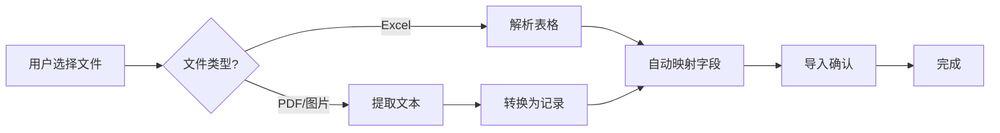

# PDF和图片导入功能 - 更新总结

## ✅ 已完成的修改

### 1. 文件上传组件更新

**文件**: `src/wsjf-sprint-planner.tsx`

**修改内容**:
```tsx
// 修改前
accept=".csv,.xlsx,.xls"

// 修改后
accept=".csv,.xlsx,.xls,.pdf,.png,.jpg,.jpeg,.webp,.bmp,.tiff,.txt"
```

**影响**: 用户现在可以在导入时选择PDF、图片和文本文件

---

### 2. 文件解析逻辑增强

**文件**: `src/utils/fileImportHelpers.ts`

**新增功能**:

#### a) 文件类型判断
```typescript
const getFileType = (file: File): 'excel' | 'pdf' | 'image' | 'text' | 'unknown'
```

#### b) Excel文件解析
```typescript
const parseExcelFile = (file: File): Promise<any[]>
```
- 保持原有功能不变
- 支持 .xlsx, .xls, .csv

#### c) PDF/图片/文本解析 (新增)
```typescript
const parseTextBasedFile = async (file: File): Promise<any[]>
```

**解析结果格式**:
```javascript
[
  {
    '文件名': 'document.pdf',
    '提取内容': '...提取的完整文本...',
    '文件类型': 'application/pdf',
    '文件大小': '1.23 KB',
    '提取时间': '2025-10-25 23:45:00'
  }
]
```

#### d) 字段自动映射优化
```typescript
systemFields: {
  name: [..., '文件名'],           // 新增：文件名映射到需求名称
  description: ['提取内容', ...],  // 新增：提取内容映射到描述
  type: [..., '文件类型'],         // 新增：文件类型映射
  submitDate: [..., '提取时间'],   // 新增：提取时间映射
}
```

---

### 3. OCR支持集成

**依赖**: 使用已有的 `fileParser.ts` 和 `ocrParser.ts`

**功能**:
- 自动检测PDF是否需要OCR
- 提供用户友好的OCR建议
- 引导用户使用批量转换工具

---

## 📋 修改的文件清单

```
src/
├── wsjf-sprint-planner.tsx         ✨ 修改 - 添加文件类型支持
├── utils/
│   ├── fileImportHelpers.ts        ✨ 修改 - 增强文件解析
│   ├── fileParser.ts               ✅ 已有 - PDF/图片解析
│   └── ocrParser.ts                ✅ 已有 - OCR检测
└── types/
    └── index.ts                    ✅ 已有 - description字段
```

---

## 🎯 新功能说明

### 支持的文件格式

| 类型 | 格式 | 处理方式 |
|------|------|----------|
| 表格 | .xlsx, .xls, .csv | 直接解析为表格数据 |
| 文档 | .pdf | 提取文本内容 |
| 图片 | .png, .jpg, .jpeg, .webp, .bmp, .tiff | OCR文本识别 |
| 文本 | .txt | 直接读取 |

### 工作流程



### 数据流转

**Excel导入**:
```
Excel文件 → 多行表格数据 → 字段映射 → 多个需求
```

**PDF/图片导入**:
```
PDF/图片 → 文本提取 → 单条记录 → 字段映射 → 单个需求
```

---

## 🚀 使用方法

### 方法1: 直接导入（有文字层的PDF）

1. 点击 "导入" 按钮
2. 选择PDF文件
3. 系统自动提取文本
4. 检查 "提取内容" 字段
5. 确认导入

### 方法2: OCR转换后导入（扫描PDF）

1. 使用批量工具转换：
   ```bash
   python scripts/ocr-tools/batch-convert.py ./扫描PDF
   ```

2. 导入生成的MD文件：
   ```bash
   # 选择 markdown_output/*.md 文件
   ```

### 方法3: 批量处理多个文件

```bash
# 1. 转换所有PDF和图片
python scripts/ocr-tools/batch-convert.py ./所有文件

# 2. 导入Markdown文件
# 在系统中逐个导入或使用导入功能
```

---

## 📊 示例对比

### Excel导入（原有功能）

**输入**:
```
需求名称 | 提交人 | 工作量
需求A   | 张三   | 5
需求B   | 李四   | 3
```

**结果**: 2条需求记录

### PDF导入（新功能）

**输入**: `requirement.pdf` (有文字层)

**提取的数据**:
```javascript
{
  '文件名': 'requirement.pdf',
  '提取内容': '需求名称: 需求A\n提交人: 张三\n工作量: 5天\n...',
  '文件类型': 'application/pdf',
  '文件大小': '245.67 KB',
  '提取时间': '2025-10-25 23:45:00'
}
```

**字段映射**:
- 文件名 → 需求名称: "requirement.pdf"
- 提取内容 → 需求描述: "需求名称: 需求A..."

**结果**: 1条需求记录

---

## ⚠️ 注意事项

### 1. 文件大小限制

- 最大: 10MB
- 超过会提示错误

### 2. OCR质量

- **有文字层的PDF**: 提取质量高 ✅
- **扫描PDF**: 需要OCR工具 ⚠️
- **图片**: 依赖OCR质量 ⚠️

### 3. 字段映射

- 自动映射可能不完全准确
- 建议在导入界面检查映射结果
- 可以手动调整

### 4. 数据格式

- PDF/图片转换为单条记录
- 如需导入多条，请使用Excel或批量转换

---

## 🧪 测试建议

### 测试1: 有文字层的PDF

```
1. 准备一个普通PDF文档
2. 点击导入，选择文件
3. 验证文本提取是否正确
4. 检查字段映射
5. 确认导入成功
```

### 测试2: 扫描PDF

```
1. 准备一个扫描的PDF
2. 点击导入，选择文件
3. 应该看到OCR建议提示
4. 按提示使用批量工具转换
5. 导入生成的MD文件
```

### 测试3: 图片文件

```
1. 准备一张包含文字的截图
2. 点击导入，选择图片
3. 验证文本提取
4. 确认导入
```

### 测试4: 混合格式

```
1. 先导入Excel文件
2. 再导入PDF文件
3. 验证两种格式都能正常导入
4. 检查数据不冲突
```

---

## 📚 相关文档

- [PDF/图片导入指南](docs/PDF_IMAGE_IMPORT_GUIDE.md) - 完整使用说明
- [OCR快速入门](docs/OCR_QUICK_START.md) - OCR工具使用
- [OCR集成文档](docs/OCR_INTEGRATION.md) - OCR技术细节

---

## 🔄 未来可能的改进

### 短期

- [ ] 优化PDF文本提取的格式化
- [ ] 添加更多文件格式（Word、PPT等）
- [ ] 改进字段自动映射算法

### 中期

- [ ] 在线OCR支持（调用API）
- [ ] 批量导入多个文件的UI
- [ ] PDF表格智能识别

### 长期

- [ ] AI自动解析PDF内容并填充字段
- [ ] 文档预览功能
- [ ] 历史导入记录

---

## 💡 最佳实践

### 1. 准备文件

- ✅ 确保PDF清晰
- ✅ 扫描件先用OCR转换
- ✅ 图片分辨率足够高

### 2. 批量处理

- ✅ 使用批量工具一次性转换
- ✅ 建立Markdown文档库
- ✅ 重复使用已转换文件

### 3. 质量控制

- ✅ 导入后检查数据
- ✅ 必要时手动调整
- ✅ 建立标准化流程

---

## ✅ 检查清单

**开发完成**:
- [x] 修改文件类型限制
- [x] 实现PDF解析逻辑
- [x] 实现图片解析逻辑
- [x] 实现文本解析逻辑
- [x] 优化字段自动映射
- [x] 集成OCR检测
- [x] 创建使用文档

**待测试**:
- [ ] Excel导入（原有功能）
- [ ] PDF导入（有文字层）
- [ ] PDF导入（扫描件）
- [ ] 图片导入
- [ ] 文本导入
- [ ] 字段映射
- [ ] 错误处理

---

**更新完成日期**: 2025-10-25
**版本**: v1.1.0
