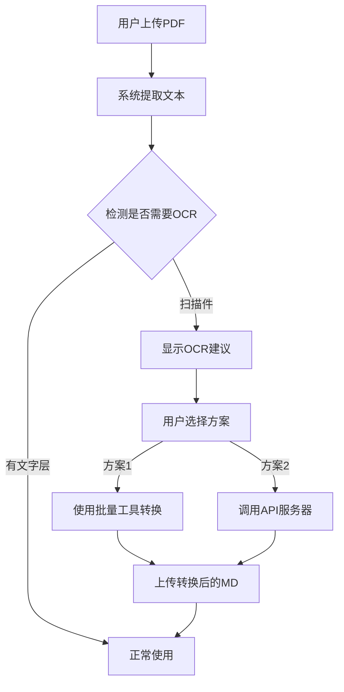

# OCR集成文档

WSJF项目已集成DeepSeek-OCR功能，用于处理扫描PDF和图片文件的文本提取。

## 功能概述

### 自动OCR检测

当用户上传PDF文件时，系统会自动检测是否为扫描件：

- **有文字层的PDF**: 快速提取文本（原有功能）
- **扫描PDF/图片**: 提示用户使用OCR工具转换

### 检测规则

系统使用以下规则判断PDF是否需要OCR：

1. **完全无文本**: 文本内容为空 → 需要OCR
2. **文本过少**: 平均每页少于50字符 → 需要OCR
3. **文本密度低**: 平均每页少于100字符 → 建议OCR

## 使用方法

### 方案1: 批量转换工具（推荐）

**适用场景**: 批量处理多个文件，或需要离线处理

**步骤**:

1. **Windows用户**（最简单）:
   ```
   双击运行: scripts/ocr-tools/batch-convert.bat
   ```

2. **命令行**:
   ```bash
   # 转换单个文件
   python scripts/ocr-tools/batch-convert.py ./我的PDF文件.pdf

   # 转换整个目录
   python scripts/ocr-tools/batch-convert.py ./PDF文件夹

   # 高质量转换
   python scripts/ocr-tools/batch-convert.py ./扫描文档 --resolution large --dpi 300
   ```

3. **转换后**:
   - 输出文件位于: `输入目录/markdown_output/`
   - 在项目中重新上传生成的`.md`文件即可

**详细说明**: 查看 [`scripts/ocr-tools/README.md`](../scripts/ocr-tools/README.md)

### 方案2: API服务器（可选）

**适用场景**: 需要在Web界面直接进行OCR转换

#### 启动API服务器

```bash
# 安装依赖（首次）
pip install fastapi uvicorn[standard] python-multipart

# 启动服务器
python scripts/ocr-tools/api-server.py

# 自定义端口
python scripts/ocr-tools/api-server.py --port 8080
```

服务器启动后：
- API地址: `http://localhost:8000`
- API文档: `http://localhost:8000/docs`

#### 前端集成

在前端代码中调用OCR API:

```typescript
import { callOCRAPI } from '@/utils/ocrParser';

// 上传文件时
async function handleFileUpload(file: File) {
  try {
    // 尝试调用OCR API
    const markdown = await callOCRAPI(file);
    console.log('OCR转换成功:', markdown);

    // 使用转换后的内容
    return markdown;

  } catch (error) {
    console.error('OCR失败:', error);

    // 降级到批量工具提示
    alert('请使用批量转换工具: scripts/ocr-tools/batch-convert.bat');
  }
}
```

## 工作流程

### 用户上传扫描PDF时



### 示例提示信息

当检测到扫描PDF时，用户会看到：

```
⚠️ OCR建议
━━━━━━━━━━━━━━━━━━━━━━━━━━━━━━━━━━━━━━━━
此PDF文件 "需求文档.pdf" 没有文字层，是扫描件或图片PDF，需要使用OCR识别。

建议操作：
1. 使用批量转换工具：双击运行 scripts/ocr-tools/batch-convert.bat
2. 或使用命令行：python scripts/ocr-tools/batch-convert.py <文件路径>
3. 详细说明参见：scripts/ocr-tools/README.md

转换后的Markdown文件可以重新上传使用。
━━━━━━━━━━━━━━━━━━━━━━━━━━━━━━━━━━━━━━━━
```

## 代码结构

### 新增文件

```
WSJF/
├── src/
│   └── utils/
│       └── ocrParser.ts          # OCR检测和API调用
├── scripts/
│   └── ocr-tools/                # OCR工具集
│       ├── batch-convert.py      # 批量转换脚本
│       ├── batch-convert.bat     # Windows快捷方式
│       ├── api-server.py         # API服务器（可选）
│       └── README.md             # 工具使用说明
└── docs/
    └── OCR_INTEGRATION.md        # 本文档
```

### 修改文件

- `src/utils/fileParser.ts`: 集成OCR检测逻辑

## 核心函数

### `ocrParser.ts`

```typescript
// 检测是否需要OCR
function needsOCR(text: string, pageCount: number): boolean

// 获取详细检测结果和建议
function detectOCRNeeds(text: string, pageCount: number, fileName: string): OCRDetectionResult

// 调用OCR API（可选）
async function callOCRAPI(file: File, apiUrl?: string): Promise<string>

// 检查API服务是否可用
async function checkOCRServiceAvailable(apiUrl?: string): Promise<boolean>
```

### `fileParser.ts`

```typescript
// 增强的PDF解析（自动检测OCR需求）
async function parsePDF(file: File): Promise<string>
```

## 性能参考

基于 NVIDIA A100 GPU：

| 分辨率 | 速度 | 单页耗时 | GPU内存 | 适用场景 |
|--------|------|----------|---------|----------|
| tiny (512) | 最快 | ~1秒 | ~2GB | 快速预览 |
| small (640) | 快 | ~1-2秒 | ~3GB | 简单文档 |
| **base (1024)** | **平衡** | **~2-3秒** | **~6GB** | **推荐** |
| large (1280) | 慢 | ~3-5秒 | ~10GB | 高质量扫描 |

## 最佳实践

### 1. 批量处理建议

对于大量文件：

```bash
# 使用中等质量快速处理
python batch-convert.py ./大量PDF --resolution base

# 处理后检查质量
# 如果质量不够，对重要文件单独使用高质量转换
python batch-convert.py ./重要文档.pdf --resolution large --dpi 300 --no-skip
```

### 2. 工作流优化

**预处理阶段**:
- 收集所有待处理PDF
- 一次性批量转换
- 存档Markdown文件

**使用阶段**:
- 直接上传Markdown文件
- 跳过OCR检测，直接使用

**优点**:
- 避免重复转换
- 提高使用效率
- 建立文档库

### 3. 质量控制

```bash
# 首次转换使用中等质量
python batch-convert.py ./文档 --resolution base

# 检查结果，对质量不足的文件重新转换
python batch-convert.py ./文档/problem.pdf --resolution large --dpi 300 --no-skip
```

## 故障排除

### 问题1: DeepSeek-OCR未安装

**症状**: 运行批量工具时提示"无法导入DocumentProcessor"

**解决**:
```bash
# 检查技能是否安装
ls ~/.claude/skills/deepseek-ocr-to-md

# 如果没有，安装技能
cd ~/.claude/skills/deepseek-ocr-to-md
python scripts/install.py
```

### 问题2: CUDA内存不足

**症状**: `CUDA out of memory`

**解决**:
```bash
# 使用更小的分辨率
python batch-convert.py ./pdfs --resolution small
```

### 问题3: API服务器无法启动

**症状**: `ModuleNotFoundError: No module named 'fastapi'`

**解决**:
```bash
pip install fastapi uvicorn[standard] python-multipart
```

### 问题4: PDF转换结果为空

**可能原因**: Poppler未安装

**解决** (Windows):
1. 下载: https://github.com/oschwartz10612/poppler-windows/releases/
2. 解压并添加`bin`文件夹到PATH

## 扩展功能

### 自定义OCR API地址

如果部署了独立的OCR服务器：

```typescript
import { callOCRAPI } from '@/utils/ocrParser';

// 使用自定义API地址
const markdown = await callOCRAPI(
  file,
  'https://your-ocr-server.com/api/convert-document'
);
```

### 批量转换自动化

创建Windows计划任务定期转换：

1. 打开"任务计划程序"
2. 创建基本任务
3. 操作: `python D:\code\WSJF\scripts\ocr-tools\batch-convert.py D:\待处理PDF`
4. 设置每天运行

## 相关资源

- [批量转换工具说明](../scripts/ocr-tools/README.md)
- [DeepSeek-OCR技能文档](~/.claude/skills/deepseek-ocr-to-md/SKILL.md)
- [DeepSeek-OCR官方仓库](https://github.com/deepseek-ai/DeepSeek-OCR)

## 更新日志

### v1.0.0 (2025-10-25)
- ✨ 初始集成DeepSeek-OCR
- ✨ 添加自动OCR检测
- ✨ 创建批量转换工具
- ✨ 创建可选API服务器
- 📚 添加完整文档

---

**问题反馈**: 如有问题，请参考 `scripts/ocr-tools/README.md` 或查看项目文档。
