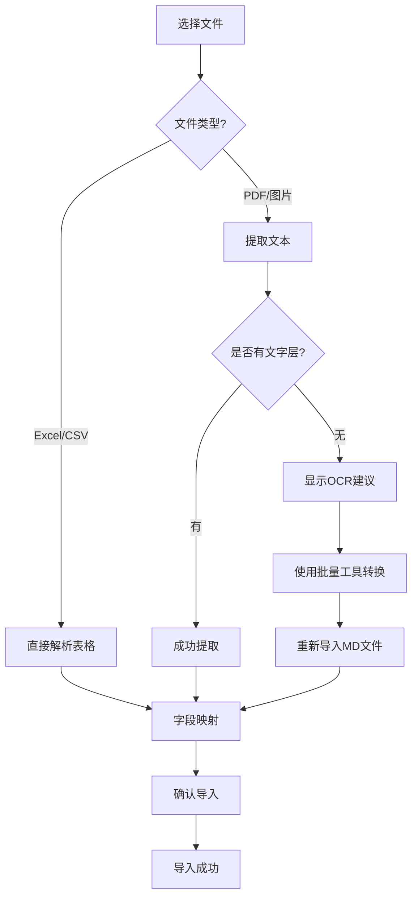

# PDF和图片导入功能使用指南

## 功能概述

WSJF项目现已支持从PDF和图片文件导入需求数据！

### 支持的文件格式

**表格文件**:
- Excel: `.xlsx`, `.xls`
- CSV: `.csv`

**文档文件** (新增):
- PDF: `.pdf`
- 图片: `.png`, `.jpg`, `.jpeg`, `.webp`, `.bmp`, `.tiff`
- 文本: `.txt`

## 工作原理

### Excel/CSV文件
- 直接解析表格数据
- 自动映射字段
- 支持多行数据

### PDF/图片/文本文件
- 自动提取文本内容
- 转换为单条记录
- 包含以下信息：
  - 文件名
  - 提取内容
  - 文件类型
  - 文件大小
  - 提取时间

## 使用步骤

### 1. 导入PDF/图片文件

```
1. 点击 "导入" 按钮
2. 选择文件（现在可以选择PDF、图片等）
3. 系统自动提取文本
4. 进入字段映射界面
```

### 2. 字段映射

系统会自动将提取的信息映射到相应字段：

| 提取字段 | 映射到需求字段 |
|---------|--------------|
| 文件名 | 需求名称 (name) |
| 提取内容 | 需求描述 (description) |
| 文件类型 | 类型 (type) |
| 提取时间 | 提交日期 (submitDate) |

### 3. 确认导入

- 检查提取的内容是否正确
- 调整字段映射（如需要）
- 点击 "确认导入"

## 使用场景

### 场景1: 导入扫描的需求文档

**问题**: 有一个PDF扫描件需要导入

**步骤**:
1. 点击 "导入"
2. 选择PDF文件
3. 系统提取文本内容
4. 查看 "提取内容" 字段，确认文本正确
5. 如果提示 "需要OCR"，使用批量转换工具先转换
6. 重新导入转换后的MD文件

### 场景2: 导入截图中的需求

**问题**: 有一个包含需求信息的截图

**步骤**:
1. 点击 "导入"
2. 选择PNG/JPG图片
3. 系统尝试提取文本
4. 检查提取结果
5. 如果文本提取不完整，使用OCR工具

### 场景3: 批量导入多个PDF

**推荐方式**: 使用批量转换工具

```bash
# 1. 批量转换为Markdown
python scripts/ocr-tools/batch-convert.py ./PDF文件夹

# 2. 导入生成的MD文件
# 在系统中选择 markdown_output/*.md 文件
```

## OCR支持

### 什么时候需要OCR？

当PDF/图片是扫描件（无文字层）时，系统会提示：

```
⚠️ OCR建议
━━━━━━━━━━━━━━━━━━━━━━━━━━━━━━━━━━━━━━━━
此PDF文件没有文字层，是扫描件或图片PDF...

建议操作：
1. 使用批量转换工具
2. 或使用命令行转换
━━━━━━━━━━━━━━━━━━━━━━━━━━━━━━━━━━━━━━━━
```

### 使用OCR批量转换

**方法1: Windows一键转换**
```
双击: scripts/ocr-tools/quick-convert.bat
```

**方法2: 命令行**
```bash
python scripts/ocr-tools/batch-convert.py ./PDF文件夹
```

**方法3: 高质量转换**
```bash
python scripts/ocr-tools/batch-convert.py ./扫描文档 --resolution large --dpi 300
```

详见: [OCR集成文档](OCR_INTEGRATION.md)

## 导入流程图



## 字段映射规则

### 自动映射

系统会自动识别以下字段：

| 源字段示例 | 目标字段 |
|-----------|---------|
| "需求名称", "名称", "文件名" | name |
| "提取内容", "内容", "描述" | description |
| "提交人", "作者" | submitterName |
| "工作量", "人天" | effortDays |
| "类型", "文件类型" | type |
| "日期", "提取时间" | submitDate |

### 手动调整

在导入界面可以手动调整字段映射：

1. 点击字段映射下拉框
2. 选择正确的目标字段
3. 确认后导入

## 最佳实践

### 1. 优先使用批量转换

对于多个文件或扫描PDF：

```bash
# 一次性转换所有文件
python batch-convert.py ./所有PDF

# 然后导入生成的MD文件
```

**优点**:
- 更好的OCR质量
- 保留文档结构
- 可重复使用

### 2. 预处理文档

在导入前：

- ✅ 确保PDF清晰可读
- ✅ 如果是扫描件，先用OCR工具处理
- ✅ 检查提取的文本是否完整

### 3. 检查导入结果

导入后：

- ✅ 检查 "需求描述" 字段
- ✅ 确认关键信息没有丢失
- ✅ 如有问题，重新转换或手动编辑

## 限制和注意事项

### 文件大小限制

- 最大: 10MB（在 `useDocumentManager.ts` 中配置）
- 超过限制会显示错误

### OCR质量

- 有文字层的PDF：提取质量高
- 扫描PDF：依赖OCR工具质量
- 手写文字：识别可能不准确
- 复杂布局：可能需要手动调整

### 图片要求

- 清晰度：越高越好（建议300 DPI以上）
- 格式：支持常见格式
- 内容：纯文本图片效果最好

## 故障排除

### 问题1: 提示"文件内容为空"

**原因**: PDF是扫描件且无法提取文本

**解决**:
```bash
# 使用OCR工具转换
python scripts/ocr-tools/batch-convert.py 文件.pdf --resolution large
```

### 问题2: 提取的文本不完整

**原因**: PDF布局复杂或OCR质量不佳

**解决**:
1. 使用更高质量设置：`--resolution large --dpi 300`
2. 或手动编辑导入后的数据

### 问题3: 字段映射不正确

**原因**: 自动映射规则无法识别

**解决**:
在导入界面手动调整字段映射

### 问题4: 无法选择PDF/图片文件

**检查**:
- 浏览器是否是最新版本
- 文件扩展名是否正确
- 文件是否损坏

## 相关文档

- [OCR快速入门](OCR_QUICK_START.md) - 5分钟上手OCR
- [OCR集成文档](OCR_INTEGRATION.md) - 完整的OCR功能说明
- [批量工具说明](../scripts/ocr-tools/README.md) - 批量转换工具

## 示例

### 示例1: 导入单个PDF

```
1. 准备: requirement.pdf (需求文档)
2. 点击: "导入" 按钮
3. 选择: requirement.pdf
4. 系统提取文本
5. 检查: "提取内容" 字段
6. 导入: 确认导入

结果:
- 文件名 → 需求名称: "requirement.pdf"
- 提取内容 → 需求描述: "...完整的文档内容..."
```

### 示例2: 批量导入多个扫描PDF

```bash
# 1. 准备文件
ls 需求文档/
  需求1.pdf (扫描件)
  需求2.pdf (扫描件)
  需求3.pdf (扫描件)

# 2. 批量转换
cd 需求文档
python ../scripts/ocr-tools/batch-convert.py .

# 3. 查看结果
ls markdown_output/
  需求1.md
  需求2.md
  需求3.md

# 4. 在系统中导入MD文件
# 选择 markdown_output/*.md 文件
```

## 更新日志

### v1.0.0 (2025-10-25)
- ✨ 添加PDF文件支持
- ✨ 添加图片文件支持
- ✨ 添加文本文件支持
- ✨ 集成OCR检测和提示
- ✨ 自动字段映射优化

---

**开始使用**: 点击 "导入" 按钮，现在就可以选择PDF和图片文件了！
