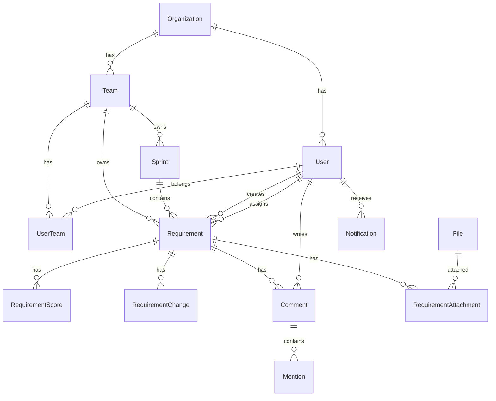

# WSJF 数据库设计文档

## 概述

本文档定义了WSJF Sprint Planner后端系统的完整数据库结构设计。采用PostgreSQL作为主数据库，设计遵循第三范式，支持多租户架构。

## 数据库选型理由

### 为什么选择PostgreSQL
1. **ACID事务支持**：确保数据一致性
2. **JSON/JSONB支持**：灵活存储非结构化数据
3. **丰富的数据类型**：UUID、数组、枚举等
4. **性能优秀**：支持复杂查询优化
5. **扩展性强**：支持分区、复制、扩展

## 数据模型设计

### 实体关系图（ERD）



## 详细表结构

### 1. 组织与用户管理

#### organizations（组织表）
```sql
CREATE TABLE organizations (
    id UUID PRIMARY KEY DEFAULT gen_random_uuid(),
    name VARCHAR(100) NOT NULL,
    description TEXT,
    logo_url VARCHAR(500),
    settings JSONB DEFAULT '{}' NOT NULL,
    -- 设置项包括：
    -- {
    --   "allowSelfRegister": false,
    --   "defaultRole": "member",
    --   "features": ["ai_evaluation", "feishu_sync"],
    --   "limits": {"maxUsers": 100, "maxRequirements": 10000}
    -- }
    is_active BOOLEAN DEFAULT true NOT NULL,
    created_at TIMESTAMP WITH TIME ZONE DEFAULT CURRENT_TIMESTAMP NOT NULL,
    updated_at TIMESTAMP WITH TIME ZONE DEFAULT CURRENT_TIMESTAMP NOT NULL,

    CONSTRAINT org_name_unique UNIQUE (name)
);

CREATE INDEX idx_org_active ON organizations(is_active);
```

#### users（用户表）
```sql
CREATE TABLE users (
    id UUID PRIMARY KEY DEFAULT gen_random_uuid(),
    organization_id UUID REFERENCES organizations(id) ON DELETE CASCADE,
    email VARCHAR(255) NOT NULL,
    password_hash VARCHAR(255), -- NULL for OAuth users
    name VARCHAR(100) NOT NULL,
    avatar_url VARCHAR(500),
    phone VARCHAR(20),
    role VARCHAR(50) DEFAULT 'member' NOT NULL CHECK (role IN ('admin', 'manager', 'member', 'viewer')),
    is_active BOOLEAN DEFAULT true NOT NULL,
    is_verified BOOLEAN DEFAULT false NOT NULL,

    -- OAuth fields
    feishu_open_id VARCHAR(100),
    feishu_union_id VARCHAR(100),
    feishu_tenant_key VARCHAR(100),

    -- Metadata
    last_login_at TIMESTAMP WITH TIME ZONE,
    login_count INTEGER DEFAULT 0 NOT NULL,
    preferences JSONB DEFAULT '{}' NOT NULL,
    -- {
    --   "language": "zh-CN",
    --   "timezone": "Asia/Shanghai",
    --   "notifications": {"email": true, "inApp": true}
    -- }

    created_at TIMESTAMP WITH TIME ZONE DEFAULT CURRENT_TIMESTAMP NOT NULL,
    updated_at TIMESTAMP WITH TIME ZONE DEFAULT CURRENT_TIMESTAMP NOT NULL,

    CONSTRAINT user_email_unique UNIQUE (email),
    CONSTRAINT user_feishu_unique UNIQUE (feishu_union_id)
);

CREATE INDEX idx_user_org ON users(organization_id);
CREATE INDEX idx_user_email ON users(email);
CREATE INDEX idx_user_active ON users(is_active);
```

#### teams（团队表）
```sql
CREATE TABLE teams (
    id UUID PRIMARY KEY DEFAULT gen_random_uuid(),
    organization_id UUID REFERENCES organizations(id) ON DELETE CASCADE NOT NULL,
    name VARCHAR(100) NOT NULL,
    description TEXT,
    type VARCHAR(50) CHECK (type IN ('business', 'product', 'tech', 'mixed')),
    parent_team_id UUID REFERENCES teams(id) ON DELETE SET NULL,

    -- Team settings
    settings JSONB DEFAULT '{}' NOT NULL,
    -- {
    --   "workingDays": 5,
    --   "sprintDuration": 14,
    --   "defaultCapacity": 50
    -- }

    is_active BOOLEAN DEFAULT true NOT NULL,
    created_at TIMESTAMP WITH TIME ZONE DEFAULT CURRENT_TIMESTAMP NOT NULL,
    updated_at TIMESTAMP WITH TIME ZONE DEFAULT CURRENT_TIMESTAMP NOT NULL,

    CONSTRAINT team_name_org_unique UNIQUE (organization_id, name)
);

CREATE INDEX idx_team_org ON teams(organization_id);
CREATE INDEX idx_team_parent ON teams(parent_team_id);
```

#### user_teams（用户-团队关联表）
```sql
CREATE TABLE user_teams (
    user_id UUID REFERENCES users(id) ON DELETE CASCADE NOT NULL,
    team_id UUID REFERENCES teams(id) ON DELETE CASCADE NOT NULL,
    role VARCHAR(50) DEFAULT 'member' NOT NULL CHECK (role IN ('owner', 'admin', 'member')),
    joined_at TIMESTAMP WITH TIME ZONE DEFAULT CURRENT_TIMESTAMP NOT NULL,

    PRIMARY KEY (user_id, team_id)
);

CREATE INDEX idx_user_team_user ON user_teams(user_id);
CREATE INDEX idx_user_team_team ON user_teams(team_id);
```

### 2. 需求管理

#### requirements（需求表）
```sql
CREATE TABLE requirements (
    id UUID PRIMARY KEY DEFAULT gen_random_uuid(),
    organization_id UUID REFERENCES organizations(id) ON DELETE CASCADE NOT NULL,
    team_id UUID REFERENCES teams(id) ON DELETE CASCADE NOT NULL,
    sprint_id UUID REFERENCES sprints(id) ON DELETE SET NULL,

    -- Basic info
    code VARCHAR(50), -- 需求编号，如 REQ-2024-001
    name VARCHAR(500) NOT NULL,
    description TEXT,
    type VARCHAR(50) DEFAULT 'feature' CHECK (
        type IN ('feature', 'tech_debt', 'bug_fix', 'optimization')
    ),
    status VARCHAR(50) DEFAULT 'draft' NOT NULL CHECK (
        status IN ('draft', 'submitted', 'reviewing', 'approved',
                  'scheduled', 'in_progress', 'testing', 'completed',
                  'cancelled', 'on_hold')
    ),
    priority VARCHAR(20) CHECK (priority IN ('P0', 'P1', 'P2', 'P3')),

    -- Business info
    business_team VARCHAR(100),
    business_domain VARCHAR(100),
    business_sub_domain VARCHAR(100),
    submitter_type VARCHAR(20) CHECK (
        submitter_type IN ('business', 'product', 'tech')
    ),

    -- Scoring
    business_impact_score INTEGER CHECK (business_impact_score BETWEEN 1 AND 10),
    complexity_score INTEGER CHECK (complexity_score BETWEEN 1 AND 10),
    effort_days DECIMAL(10,2) CHECK (effort_days > 0),
    wsjf_score DECIMAL(10,4), -- Calculated: business_impact / effort

    -- Dates
    deadline_date DATE,
    planned_start_date DATE,
    planned_end_date DATE,
    actual_start_date DATE,
    actual_end_date DATE,

    -- Relations
    parent_requirement_id UUID REFERENCES requirements(id) ON DELETE SET NULL,
    created_by UUID REFERENCES users(id) ON DELETE SET NULL NOT NULL,
    assigned_to UUID REFERENCES users(id) ON DELETE SET NULL,
    reviewed_by UUID REFERENCES users(id) ON DELETE SET NULL,

    -- External sync
    feishu_work_item_id VARCHAR(100),
    feishu_work_item_type_key VARCHAR(100),
    feishu_project_key VARCHAR(100),
    feishu_sync_at TIMESTAMP WITH TIME ZONE,
    external_refs JSONB DEFAULT '{}' NOT NULL,
    -- {
    --   "jira": {"key": "PROJ-123", "url": "..."},
    --   "confluence": {"pageId": "12345"}
    -- }

    -- Metadata
    tags TEXT[] DEFAULT '{}' NOT NULL,
    custom_fields JSONB DEFAULT '{}' NOT NULL,
    metrics JSONB DEFAULT '{}' NOT NULL,
    -- {
    --   "affected": [
    --     {"key": "revenue", "impact": "+5%"},
    --     {"key": "user_satisfaction", "impact": "improve"}
    --   ]
    -- }

    -- Timestamps
    submitted_at TIMESTAMP WITH TIME ZONE,
    approved_at TIMESTAMP WITH TIME ZONE,
    completed_at TIMESTAMP WITH TIME ZONE,
    created_at TIMESTAMP WITH TIME ZONE DEFAULT CURRENT_TIMESTAMP NOT NULL,
    updated_at TIMESTAMP WITH TIME ZONE DEFAULT CURRENT_TIMESTAMP NOT NULL,

    CONSTRAINT req_dates_valid CHECK (
        (planned_end_date IS NULL OR planned_start_date IS NULL) OR
        planned_end_date >= planned_start_date
    )
);

-- Indexes for performance
CREATE INDEX idx_req_org ON requirements(organization_id);
CREATE INDEX idx_req_team ON requirements(team_id);
CREATE INDEX idx_req_sprint ON requirements(sprint_id);
CREATE INDEX idx_req_status ON requirements(status);
CREATE INDEX idx_req_type ON requirements(type);
CREATE INDEX idx_req_priority ON requirements(priority);
CREATE INDEX idx_req_created_by ON requirements(created_by);
CREATE INDEX idx_req_assigned_to ON requirements(assigned_to);
CREATE INDEX idx_req_parent ON requirements(parent_requirement_id);
CREATE INDEX idx_req_deadline ON requirements(deadline_date);
CREATE INDEX idx_req_wsjf ON requirements(wsjf_score DESC NULLS LAST);
CREATE INDEX idx_req_feishu ON requirements(feishu_work_item_id);
CREATE INDEX idx_req_tags ON requirements USING GIN(tags);
```

#### requirement_scores_history（需求评分历史表）
```sql
CREATE TABLE requirement_scores_history (
    id UUID PRIMARY KEY DEFAULT gen_random_uuid(),
    requirement_id UUID REFERENCES requirements(id) ON DELETE CASCADE NOT NULL,
    scorer_id UUID REFERENCES users(id) ON DELETE SET NULL,

    business_impact_score INTEGER CHECK (business_impact_score BETWEEN 1 AND 10),
    complexity_score INTEGER CHECK (complexity_score BETWEEN 1 AND 10),
    effort_days DECIMAL(10,2),
    wsjf_score DECIMAL(10,4),

    score_reason TEXT,
    score_type VARCHAR(50) CHECK (score_type IN ('manual', 'ai_suggested', 'imported')),

    scored_at TIMESTAMP WITH TIME ZONE DEFAULT CURRENT_TIMESTAMP NOT NULL
);

CREATE INDEX idx_score_req ON requirement_scores_history(requirement_id);
CREATE INDEX idx_score_user ON requirement_scores_history(scorer_id);
CREATE INDEX idx_score_time ON requirement_scores_history(scored_at DESC);
```

#### requirement_changes（需求变更历史表）
```sql
CREATE TABLE requirement_changes (
    id UUID PRIMARY KEY DEFAULT gen_random_uuid(),
    requirement_id UUID REFERENCES requirements(id) ON DELETE CASCADE NOT NULL,
    changed_by UUID REFERENCES users(id) ON DELETE SET NULL,

    change_type VARCHAR(50) NOT NULL CHECK (
        change_type IN ('created', 'updated', 'status_changed',
                       'scored', 'assigned', 'moved_sprint',
                       'priority_changed', 'deleted')
    ),

    -- Store the changes in JSONB format
    old_values JSONB,
    new_values JSONB,
    change_description TEXT,

    changed_at TIMESTAMP WITH TIME ZONE DEFAULT CURRENT_TIMESTAMP NOT NULL
);

CREATE INDEX idx_change_req ON requirement_changes(requirement_id);
CREATE INDEX idx_change_user ON requirement_changes(changed_by);
CREATE INDEX idx_change_type ON requirement_changes(change_type);
CREATE INDEX idx_change_time ON requirement_changes(changed_at DESC);
```

### 3. Sprint管理

#### sprints（Sprint表）
```sql
CREATE TABLE sprints (
    id UUID PRIMARY KEY DEFAULT gen_random_uuid(),
    team_id UUID REFERENCES teams(id) ON DELETE CASCADE NOT NULL,

    name VARCHAR(200) NOT NULL,
    sprint_number INTEGER,
    start_date DATE NOT NULL,
    end_date DATE NOT NULL,

    goals TEXT,
    retrospective TEXT,

    status VARCHAR(50) DEFAULT 'planning' NOT NULL CHECK (
        status IN ('planning', 'active', 'completed', 'cancelled')
    ),

    -- Capacity planning
    capacity JSONB DEFAULT '{}' NOT NULL,
    -- {
    --   "developers": 5,
    --   "totalDays": 50,
    --   "holidays": 2,
    --   "availableDays": 48,
    --   "velocity": 40
    -- }

    -- Statistics (calculated and cached)
    statistics JSONB DEFAULT '{}' NOT NULL,
    -- {
    --   "totalRequirements": 20,
    --   "completedRequirements": 18,
    --   "totalEffort": 45,
    --   "completedEffort": 42,
    --   "completionRate": 0.9
    -- }

    created_by UUID REFERENCES users(id) ON DELETE SET NULL,
    started_at TIMESTAMP WITH TIME ZONE,
    completed_at TIMESTAMP WITH TIME ZONE,
    created_at TIMESTAMP WITH TIME ZONE DEFAULT CURRENT_TIMESTAMP NOT NULL,
    updated_at TIMESTAMP WITH TIME ZONE DEFAULT CURRENT_TIMESTAMP NOT NULL,

    CONSTRAINT sprint_dates_valid CHECK (end_date > start_date),
    CONSTRAINT sprint_name_team_unique UNIQUE (team_id, name)
);

CREATE INDEX idx_sprint_team ON sprints(team_id);
CREATE INDEX idx_sprint_status ON sprints(status);
CREATE INDEX idx_sprint_dates ON sprints(start_date, end_date);
```

### 4. 协作功能

#### comments（评论表）
```sql
CREATE TABLE comments (
    id UUID PRIMARY KEY DEFAULT gen_random_uuid(),
    requirement_id UUID REFERENCES requirements(id) ON DELETE CASCADE NOT NULL,
    user_id UUID REFERENCES users(id) ON DELETE SET NULL,

    content TEXT NOT NULL,
    parent_comment_id UUID REFERENCES comments(id) ON DELETE CASCADE,

    is_edited BOOLEAN DEFAULT false NOT NULL,
    is_deleted BOOLEAN DEFAULT false NOT NULL,

    created_at TIMESTAMP WITH TIME ZONE DEFAULT CURRENT_TIMESTAMP NOT NULL,
    updated_at TIMESTAMP WITH TIME ZONE DEFAULT CURRENT_TIMESTAMP NOT NULL
);

CREATE INDEX idx_comment_req ON comments(requirement_id);
CREATE INDEX idx_comment_user ON comments(user_id);
CREATE INDEX idx_comment_parent ON comments(parent_comment_id);
```

#### notifications（通知表）
```sql
CREATE TABLE notifications (
    id UUID PRIMARY KEY DEFAULT gen_random_uuid(),
    user_id UUID REFERENCES users(id) ON DELETE CASCADE NOT NULL,

    type VARCHAR(50) NOT NULL CHECK (
        type IN ('requirement_assigned', 'comment_mention',
                'sprint_started', 'sprint_completed',
                'requirement_updated', 'deadline_approaching')
    ),

    title VARCHAR(200) NOT NULL,
    content TEXT,

    -- Related entities
    data JSONB DEFAULT '{}' NOT NULL,
    -- {
    --   "requirementId": "...",
    --   "sprintId": "...",
    --   "commentId": "..."
    -- }

    is_read BOOLEAN DEFAULT false NOT NULL,
    read_at TIMESTAMP WITH TIME ZONE,

    created_at TIMESTAMP WITH TIME ZONE DEFAULT CURRENT_TIMESTAMP NOT NULL
);

CREATE INDEX idx_notif_user ON notifications(user_id);
CREATE INDEX idx_notif_read ON notifications(is_read);
CREATE INDEX idx_notif_type ON notifications(type);
CREATE INDEX idx_notif_created ON notifications(created_at DESC);
```

### 5. 文件管理

#### files（文件表）
```sql
CREATE TABLE files (
    id UUID PRIMARY KEY DEFAULT gen_random_uuid(),
    organization_id UUID REFERENCES organizations(id) ON DELETE CASCADE NOT NULL,

    filename VARCHAR(255) NOT NULL,
    original_name VARCHAR(255) NOT NULL,
    mime_type VARCHAR(100),
    size_bytes BIGINT NOT NULL,

    storage_type VARCHAR(50) DEFAULT 'local' CHECK (
        storage_type IN ('local', 's3', 'oss', 'azure')
    ),
    storage_path VARCHAR(500) NOT NULL,
    public_url VARCHAR(500),

    -- Metadata
    metadata JSONB DEFAULT '{}' NOT NULL,
    -- {
    --   "width": 1920,
    --   "height": 1080,
    --   "pages": 10,
    --   "ocr_processed": true
    -- }

    uploaded_by UUID REFERENCES users(id) ON DELETE SET NULL,
    uploaded_at TIMESTAMP WITH TIME ZONE DEFAULT CURRENT_TIMESTAMP NOT NULL
);

CREATE INDEX idx_file_org ON files(organization_id);
CREATE INDEX idx_file_uploader ON files(uploaded_by);
CREATE INDEX idx_file_mime ON files(mime_type);
```

#### requirement_attachments（需求附件关联表）
```sql
CREATE TABLE requirement_attachments (
    requirement_id UUID REFERENCES requirements(id) ON DELETE CASCADE NOT NULL,
    file_id UUID REFERENCES files(id) ON DELETE CASCADE NOT NULL,

    attachment_type VARCHAR(50) DEFAULT 'document' CHECK (
        attachment_type IN ('document', 'image', 'spreadsheet', 'other')
    ),
    display_order INTEGER DEFAULT 0,

    attached_at TIMESTAMP WITH TIME ZONE DEFAULT CURRENT_TIMESTAMP NOT NULL,
    attached_by UUID REFERENCES users(id) ON DELETE SET NULL,

    PRIMARY KEY (requirement_id, file_id)
);

CREATE INDEX idx_attach_req ON requirement_attachments(requirement_id);
CREATE INDEX idx_attach_file ON requirement_attachments(file_id);
```

### 6. AI分析记录

#### ai_analysis_records（AI分析记录表）
```sql
CREATE TABLE ai_analysis_records (
    id UUID PRIMARY KEY DEFAULT gen_random_uuid(),
    requirement_id UUID REFERENCES requirements(id) ON DELETE CASCADE,

    model_provider VARCHAR(50) NOT NULL CHECK (
        model_provider IN ('openai', 'deepseek', 'anthropic', 'custom')
    ),
    model_name VARCHAR(100),

    analysis_type VARCHAR(50) CHECK (
        analysis_type IN ('scoring', 'description', 'extraction', 'batch')
    ),

    request_data JSONB NOT NULL,
    response_data JSONB NOT NULL,

    tokens_used INTEGER,
    cost_usd DECIMAL(10,6),
    duration_ms INTEGER,

    status VARCHAR(50) DEFAULT 'success' CHECK (
        status IN ('success', 'failed', 'timeout')
    ),
    error_message TEXT,

    analyzed_by UUID REFERENCES users(id) ON DELETE SET NULL,
    analyzed_at TIMESTAMP WITH TIME ZONE DEFAULT CURRENT_TIMESTAMP NOT NULL
);

CREATE INDEX idx_ai_req ON ai_analysis_records(requirement_id);
CREATE INDEX idx_ai_user ON ai_analysis_records(analyzed_by);
CREATE INDEX idx_ai_provider ON ai_analysis_records(model_provider);
CREATE INDEX idx_ai_type ON ai_analysis_records(analysis_type);
```

#### ocr_records（OCR处理记录表）
```sql
CREATE TABLE ocr_records (
    id UUID PRIMARY KEY DEFAULT gen_random_uuid(),
    file_id UUID REFERENCES files(id) ON DELETE CASCADE,

    backend VARCHAR(50) NOT NULL CHECK (
        backend IN ('ocrspace', 'baidu', 'tesseract', 'auto')
    ),

    extracted_text TEXT,
    confidence_score DECIMAL(3,2),

    processing_time_ms INTEGER,
    status VARCHAR(50) DEFAULT 'success' CHECK (
        status IN ('success', 'failed', 'processing')
    ),
    error_message TEXT,

    processed_at TIMESTAMP WITH TIME ZONE DEFAULT CURRENT_TIMESTAMP NOT NULL
);

CREATE INDEX idx_ocr_file ON ocr_records(file_id);
CREATE INDEX idx_ocr_status ON ocr_records(status);
```

### 7. 系统配置与审计

#### audit_logs（审计日志表）
```sql
CREATE TABLE audit_logs (
    id UUID PRIMARY KEY DEFAULT gen_random_uuid(),
    organization_id UUID REFERENCES organizations(id) ON DELETE CASCADE,
    user_id UUID REFERENCES users(id) ON DELETE SET NULL,

    action VARCHAR(100) NOT NULL,
    entity_type VARCHAR(50),
    entity_id UUID,

    ip_address INET,
    user_agent TEXT,

    old_data JSONB,
    new_data JSONB,

    created_at TIMESTAMP WITH TIME ZONE DEFAULT CURRENT_TIMESTAMP NOT NULL
);

CREATE INDEX idx_audit_org ON audit_logs(organization_id);
CREATE INDEX idx_audit_user ON audit_logs(user_id);
CREATE INDEX idx_audit_entity ON audit_logs(entity_type, entity_id);
CREATE INDEX idx_audit_action ON audit_logs(action);
CREATE INDEX idx_audit_time ON audit_logs(created_at DESC);
```

#### system_configs（系统配置表）
```sql
CREATE TABLE system_configs (
    id UUID PRIMARY KEY DEFAULT gen_random_uuid(),
    organization_id UUID REFERENCES organizations(id) ON DELETE CASCADE,

    config_key VARCHAR(100) NOT NULL,
    config_value JSONB NOT NULL,
    description TEXT,

    is_encrypted BOOLEAN DEFAULT false NOT NULL,

    created_at TIMESTAMP WITH TIME ZONE DEFAULT CURRENT_TIMESTAMP NOT NULL,
    updated_at TIMESTAMP WITH TIME ZONE DEFAULT CURRENT_TIMESTAMP NOT NULL,

    CONSTRAINT config_key_org_unique UNIQUE (organization_id, config_key)
);

CREATE INDEX idx_config_org ON system_configs(organization_id);
CREATE INDEX idx_config_key ON system_configs(config_key);
```

## 数据库优化策略

### 索引策略
1. 主键自动创建唯一索引
2. 外键字段创建普通索引
3. 常用查询条件创建复合索引
4. JSONB字段使用GIN索引
5. 全文搜索使用GiST索引

### 分区策略
```sql
-- 对大表进行分区，如需求表按创建时间分区
CREATE TABLE requirements_2024_q1 PARTITION OF requirements
    FOR VALUES FROM ('2024-01-01') TO ('2024-04-01');
```

### 性能优化
1. **连接池配置**：最大连接数100，最小10
2. **查询优化**：使用EXPLAIN分析慢查询
3. **定期维护**：VACUUM和ANALYZE
4. **缓存策略**：Redis缓存热点数据

## 数据迁移策略

### 从前端localStorage迁移
1. 导出前端数据为JSON
2. 编写迁移脚本映射数据结构
3. 批量导入到数据库
4. 验证数据完整性

### 版本升级迁移
```sql
-- 使用迁移工具如TypeORM migrations
-- migrations/001_initial_schema.sql
-- migrations/002_add_ai_tables.sql
```

## 备份与恢复

### 备份策略
1. **全量备份**：每日凌晨2点
2. **增量备份**：每小时
3. **归档日志**：实时流复制

### 恢复流程
```bash
# 恢复到特定时间点
pg_restore -d wsjf_prod backup_2024_11_04.dump
```

## 安全考虑

1. **数据加密**
   - 传输加密：SSL/TLS
   - 存储加密：敏感字段加密

2. **访问控制**
   - Row Level Security (RLS)
   - 最小权限原则

3. **SQL注入防护**
   - 参数化查询
   - 输入验证

## 监控指标

1. **性能指标**
   - 查询响应时间
   - 连接池使用率
   - 缓存命中率

2. **业务指标**
   - 每日新增需求数
   - 活跃用户数
   - Sprint完成率

## 下一步工作

1. 创建数据库初始化脚本
2. 编写数据迁移工具
3. 实现ORM映射
4. 性能基准测试