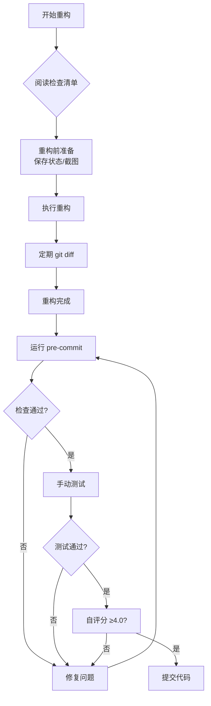

# 重构错误预防措施实施指南

> 📅 创建日期: 2025-10-25
> 🎯 目标: 防止重构时再次出现功能性bug

---

## 📌 问题回顾

### 本次发现的重构问题

1. **按钮 type 属性丢失** (严重级别: 🔴 高)
   - 21个 `type="button"` 属性在重构时丢失
   - 导致浏览器自动下载HTML文件
   - 影响核心用户流程

2. **字段位置错误** (严重级别: 🟡 中)
   - "产品进展"和"技术进展"放错 section
   - 违背原始UI/UX设计
   - 影响用户体验

### 根本原因

```
❌ 手动复制粘贴 → 属性丢失
❌ 缺少 diff 对比 → 未发现删除
❌ 缺少测试 → bug未被发现
❌ 没有参考设计 → 布局错误
```

---

## ✅ 已实施的预防措施

### 1. 创建重构检查清单 ⭐⭐⭐

**文件**: `docs/checklists/refactoring-checklist.md`

**内容**:
- 重构前准备（保存状态、截图、分析结构）
- 重构中执行（渐进式、定期对比、保持属性）
- 重构后验证（git diff、测试、UI对比）
- 质量自评（≥4.0才能提交）

**使用方法**:
```bash
# 每次重构前，打开此文件
cat docs/checklists/refactoring-checklist.md

# 逐项完成检查清单
```

### 2. 配置 ESLint 规则 ⭐⭐⭐

**文件**: `.eslintrc.cjs`

**新增规则**:
```js
{
  rules: {
    // 强制所有按钮必须有 type 属性
    'react/button-has-type': ['error', {
      'button': true,
      'submit': true,
      'reset': true
    }]
  }
}
```

**效果**: 编辑器会实时提示缺少 type 的按钮

**依赖安装**:
```bash
npm install --save-dev eslint-plugin-react
```

### 3. Git Pre-Commit Hook ⭐⭐⭐

**文件**: `scripts/pre-commit-check.sh`

**自动检查项**:
1. ✅ 检测丢失的 `type="button"` 属性
2. ✅ 检测新增按钮缺少 type
3. ✅ 检测调试代码（console.log/debugger）
4. ✅ TypeScript 编译检查
5. ✅ 文件大小检查（500行限制）
6. ✅ 检查未完成的 TODO/FIXME

**配置方法**:
```bash
# 方法1: 使用 Husky (推荐)
npm install --save-dev husky
npm run prepare
npx husky add .husky/pre-commit "npm run pre-commit"

# 方法2: 手动配置 (备选)
# Windows (Git Bash)
cp scripts/pre-commit-check.sh .git/hooks/pre-commit
chmod +x .git/hooks/pre-commit

# Linux/Mac
ln -s ../../scripts/pre-commit-check.sh .git/hooks/pre-commit
chmod +x .git/hooks/pre-commit
```

**测试hook**:
```bash
# 故意创建一个没有 type 的按钮，然后提交
git add .
git commit -m "test"

# 应该被拦截并提示错误
```

### 4. 详细的问题分析文档 ⭐⭐

**文件**: `docs/refactoring-lessons/refactoring-bug-analysis.md`

**内容**:
- 问题详细描述
- 根本原因分析
- 修复方案
- 预防措施
- 行动计划

**用途**: 团队学习和案例参考

### 5. NPM Scripts 增强 ⭐

**已添加脚本**:
```json
{
  "scripts": {
    "pre-commit": "npm run check-file-size",
    "pre-deploy-check": "bash scripts/pre-deploy-check.sh"
  }
}
```

**使用方法**:
```bash
# 提交前检查
npm run pre-commit

# 部署前检查
npm run pre-deploy-check
```

---

## 🎯 使用流程

### 重构工作标准流程



### 实际操作步骤

#### 第1步：准备工作（5分钟）

```bash
# 1. 创建分支
git checkout -b refactor/component-name

# 2. 记录当前状态
wc -l src/components/XXX.tsx

# 3. 截图保存（如果是UI组件）
# 保存到 docs/screenshots/before-refactor/

# 4. 打开检查清单
cat docs/checklists/refactoring-checklist.md
```

#### 第2步：执行重构（N小时）

```bash
# 1. 渐进式重构
# 每完成一个小模块，立即验证

# 2. 定期对比
git diff

# 3. 检查关键属性
git diff | grep -E "^\-.*type=\"button\""

# 4. 频繁提交
git add .
git commit -m "refactor: 完成XXX模块"
```

#### 第3步：验证检查（10-15分钟）

```bash
# 1. 运行 pre-commit 检查
npm run pre-commit

# 2. TypeScript 检查
npx tsc --noEmit

# 3. 生产构建
npm run build

# 4. 手动测试（打开浏览器）
npm run dev
# 测试所有交互功能

# 5. 对比截图
# 对比重构前后的界面
```

#### 第4步：自评和提交（5分钟）

```bash
# 1. 自评分（使用检查清单中的评分表）
# 功能完整性: 5/5
# 代码简洁性: 5/5
# 测试覆盖率: 4/5
# 总分: 4.6/5 ✅

# 2. 提交
git add .
git commit -m "refactor: EditRequirementModal (2229 → 442行, -80%)"

# 3. 推送
git push origin refactor/component-name
```

---

## 📊 预期效果

### 短期效果（1周内）

- ✅ 所有新增按钮都有 type 属性
- ✅ 重构时不会丢失关键属性
- ✅ 提交前自动检查拦截问题
- ✅ 减少功能性bug

### 中期效果（1个月内）

- ✅ 团队建立重构最佳实践
- ✅ 代码质量持续提升
- ✅ 重构效率提高
- ✅ Bug修复时间减少

### 长期效果（3个月以上）

- ✅ 形成系统化的质量保证体系
- ✅ 技术债务减少
- ✅ 可维护性大幅提升
- ✅ 开发效率提高

---

## 🔄 持续改进

### 定期Review（每月）

```markdown
## 重构质量Review清单

1. [ ] 检查本月重构次数
2. [ ] 检查本月重构引入的bug数量
3. [ ] 统计 pre-commit hook 拦截的问题数
4. [ ] 更新检查清单（如果发现新问题）
5. [ ] 团队分享经验教训
```

### 指标跟踪

| 指标 | 目标 | 当前 |
|------|------|------|
| 重构引入bug率 | < 5% | [ ] |
| pre-commit拦截率 | > 90% | [ ] |
| 平均自评分 | ≥ 4.0 | [ ] |
| 代码review通过率 | > 95% | [ ] |

---

## 🚀 下一步行动

### 立即执行（今天）✅

- [x] 创建重构检查清单
- [x] 配置 ESLint 规则
- [x] 创建 pre-commit hook
- [x] 编写问题分析文档
- [ ] 配置 Git hook（需要团队成员各自配置）
- [ ] 团队宣讲（5分钟介绍）

### 本周执行

- [ ] 测试 pre-commit hook 有效性
- [ ] 收集团队反馈
- [ ] 改进检查清单
- [ ] 编写更多测试用例

### 持续执行

- [ ] 每次重构使用检查清单
- [ ] 每月Review重构质量
- [ ] 持续改进工具和流程
- [ ] 记录新的经验教训

---

## 📚 相关文档

- [重构检查清单](../checklists/refactoring-checklist.md)
- [重构Bug分析](../refactoring-lessons/refactoring-bug-analysis.md)
- [架构指导原则](../architecture-guide.md)
- [新功能开发流程](../new-feature-workflow.md)

---

## 💡 最佳实践总结

### Do ✅

1. **重构前**:
   - 阅读检查清单
   - 保存原始状态
   - 分析代码结构

2. **重构中**:
   - 渐进式重构
   - 定期 git diff
   - 保持属性完整

3. **重构后**:
   - 运行自动检查
   - 手动测试
   - 对比截图
   - 自评分

### Don't ❌

1. **不要**大规模重写代码
2. **不要**跳过测试环节
3. **不要**忽略 pre-commit 警告
4. **不要**只关注代码行数
5. **不要**在没有理解原设计的情况下重构

---

**记住**: 质量 > 速度，功能完整性 > 代码简洁性
