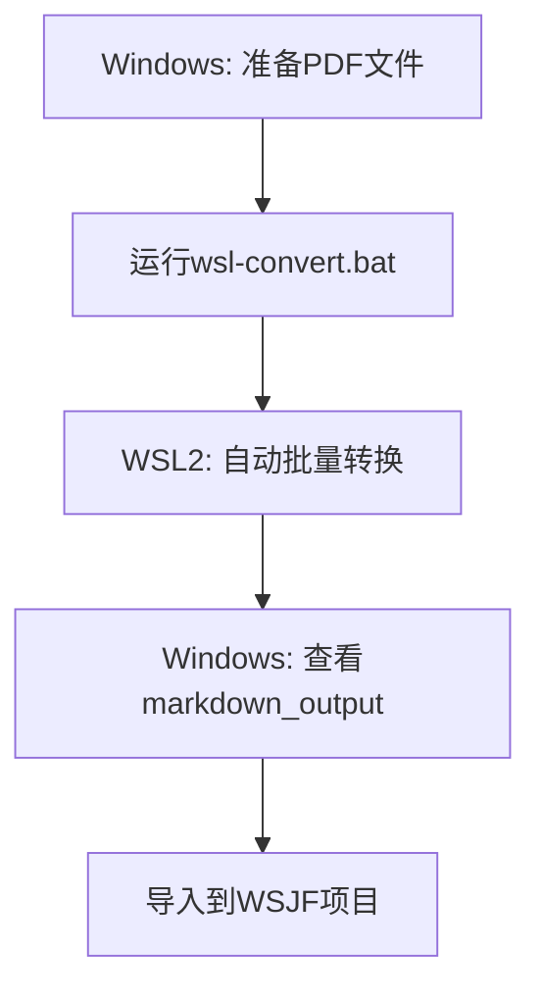

# WSL2 DeepSeek-OCR 快速开始指南

您已经有WSL2，太好了！按照以下3个步骤即可开始使用。

## 🚀 3步快速开始

### 第1步: 在WSL2中安装DeepSeek-OCR（10分钟）

打开PowerShell，运行：

```powershell
# 进入WSL2
wsl

# 下载并运行快速安装脚本
cd /mnt/d/code/WSJF/scripts/ocr-tools
bash wsl-quick-install.sh
```

**安装过程会**:
- 安装Python 3.12
- 创建虚拟环境
- 安装PyTorch、vLLM等
- 下载DeepSeek-OCR模型（~3-6GB）

**预计耗时**: 10-20分钟（取决于网速和机器配置）

---

### 第2步: 测试转换（1分钟）

安装完成后，在WSL2中测试：

```bash
# 激活环境（如果未激活）
source ~/deepseek-env/bin/activate

# 测试转换一个文件
# 注意：Windows的C盘在WSL2中是 /mnt/c
python3 ~/.claude/skills/deepseek-ocr-to-md/scripts/convert_to_md.py \
  --input "/mnt/c/Users/Evan Tian/Downloads/DSTE/deepseek.pdf" \
  --output "/mnt/c/Users/Evan Tian/Downloads/DSTE/test.md"
```

如果成功，说明安装正确！

---

### 第3步: 批量转换（随时使用）

#### 方法A: 在WSL2中批量转换

```bash
# 在WSL2中运行
wsl

# 运行批量转换脚本
bash /mnt/d/code/WSJF/scripts/ocr-tools/wsl2-batch-convert.sh "C:\Users\Evan Tian\Downloads\DSTE"
```

#### 方法B: 从Windows直接调用（更简单）

```cmd
# 在Windows CMD或PowerShell中运行
D:\code\WSJF\scripts\ocr-tools\wsl-convert.bat "C:\Users\Evan Tian\Downloads\DSTE"
```

---

## 📂 路径转换规则

### Windows → WSL2

| Windows路径 | WSL2路径 |
|------------|----------|
| `C:\Users\Evan Tian\Downloads\DSTE` | `/mnt/c/Users/Evan Tian/Downloads/DSTE` |
| `D:\code\WSJF` | `/mnt/d/code/WSJF` |

**规则**:
1. 盘符小写: `C:` → `/mnt/c`
2. 反斜杠变正斜杠: `\` → `/`
3. 空格加引号: `"Evan Tian"` 或 `Evan\ Tian`

---

## 💡 常用命令

### 激活DeepSeek-OCR环境

```bash
# 每次使用前需要激活
source ~/deepseek-env/bin/activate

# 或使用快捷命令（安装脚本会创建）
ocr-activate
```

### 转换单个文件

```bash
# 激活环境后
ocr-convert --input /mnt/c/path/to/file.pdf --output output.md

# 或完整命令
python3 ~/.claude/skills/deepseek-ocr-to-md/scripts/convert_to_md.py \
  --input "/mnt/c/Users/Evan Tian/Downloads/scan.pdf" \
  --output "/mnt/c/Users/Evan Tian/Downloads/result.md" \
  --resolution base
```

### 批量转换目录

```bash
# 使用批量脚本
bash /mnt/d/code/WSJF/scripts/ocr-tools/wsl2-batch-convert.sh "C:\Users\Evan Tian\Downloads\DSTE"
```

---

## 🎯 工作流程

### 典型使用流程



### 详细步骤

```
1. 在Windows中准备PDF文件夹
   C:\Users\Evan Tian\Downloads\DSTE\

2. 双击运行桥接工具
   D:\code\WSJF\scripts\ocr-tools\wsl-convert.bat

3. WSL2自动处理所有文件
   - 检测文件类型
   - 调用DeepSeek-OCR
   - 生成Markdown文件

4. 在Windows中查看结果
   C:\Users\Evan Tian\Downloads\DSTE\markdown_output\

5. 在WSJF项目中导入MD文件
```

---

## 📋 安装检查清单

完成第1步安装后，检查以下项目：

```bash
# 在WSL2中运行这些命令

# 1. Python版本
python3.12 --version
# 应该是: Python 3.12.x

# 2. 虚拟环境
source ~/deepseek-env/bin/activate
which python3
# 应该是: /home/xxx/deepseek-env/bin/python3

# 3. PyTorch
python3 -c "import torch; print(f'PyTorch: {torch.__version__}')"
# 应该是: PyTorch: 2.6.0

# 4. CUDA
python3 -c "import torch; print(f'CUDA: {torch.cuda.is_available()}')"
# 应该是: CUDA: True（如果有GPU）

# 5. vLLM
python3 -c "import vllm; print(f'vLLM: {vllm.__version__}')"
# 应该是: vLLM: 0.8.5

# 6. Poppler
pdfinfo -v
# 应该显示版本信息
```

全部通过 → 安装成功！ ✅

---

## 🔧 常见问题

### Q1: nvidia-smi找不到

**在WSL2中运行**:
```bash
nvidia-smi
```

**如果报错**: `command not found`

**解决**:
1. 确保Windows上安装了最新NVIDIA驱动（>=470.x）
2. 重启WSL2: 在PowerShell中运行 `wsl --shutdown`，然后重新进入

### Q2: CUDA不可用

**检查**:
```bash
python3 -c "import torch; print(torch.cuda.is_available())"
```

**如果显示False**:

可能需要安装CUDA toolkit：
```bash
wget https://developer.download.nvidia.com/compute/cuda/repos/wsl-ubuntu/x86_64/cuda-keyring_1.0-1_all.deb
sudo dpkg -i cuda-keyring_1.0-1_all.deb
sudo apt-get update
sudo apt-get -y install cuda-toolkit-11-8
```

### Q3: 虚拟环境激活失败

**症状**:
```
bash: /home/xxx/deepseek-env/bin/activate: No such file or directory
```

**解决**:
```bash
# 重新创建环境
rm -rf ~/deepseek-env
python3.12 -m venv ~/deepseek-env
source ~/deepseek-env/bin/activate
```

---

## 📊 性能参考

基于不同GPU：

| GPU型号 | 速度 | 推荐分辨率 |
|---------|------|-----------|
| RTX 4090 | 极快 | large |
| RTX 3090 | 很快 | large |
| RTX 3080 | 快 | base/large |
| RTX 3070 | 中 | base |
| RTX 3060 | 中 | base |
| GTX 1080 Ti | 慢 | small/base |

**单页处理时间**（base分辨率）:
- RTX 4090: ~1秒
- RTX 3080: ~2-3秒
- RTX 3060: ~3-5秒

---

## 🎯 最佳实践

### 1. 保持环境激活

每次使用前激活：
```bash
source ~/deepseek-env/bin/activate
```

### 2. 批量处理大文件

```bash
# 使用批量脚本一次处理整个目录
bash wsl2-batch-convert.sh "C:\Your\PDF\Folder"
```

### 3. 调整质量设置

根据文档质量选择：
- 简单文档: `--resolution small`
- 一般文档: `--resolution base`（推荐）
- 复杂文档: `--resolution large --dpi 300`

---

## 📚 完整命令示例

### 示例1: 转换Downloads中的所有PDF

```bash
# 在WSL2中
wsl

# 激活环境
source ~/deepseek-env/bin/activate

# 批量转换
bash /mnt/d/code/WSJF/scripts/ocr-tools/wsl2-batch-convert.sh \
  "C:\Users\Evan Tian\Downloads\DSTE"

# 或使用WSL路径
bash /mnt/d/code/WSJF/scripts/ocr-tools/wsl2-batch-convert.sh \
  "/mnt/c/Users/Evan Tian/Downloads/DSTE"
```

### 示例2: 从Windows调用

```cmd
REM 在Windows PowerShell或CMD中
D:\code\WSJF\scripts\ocr-tools\wsl-convert.bat "C:\Users\Evan Tian\Downloads\DSTE"
```

### 示例3: 高质量转换单个文件

```bash
# 在WSL2中
source ~/deepseek-env/bin/activate

python3 ~/.claude/skills/deepseek-ocr-to-md/scripts/convert_to_md.py \
  --input "/mnt/c/Users/Evan Tian/Downloads/important.pdf" \
  --output "/mnt/c/Users/Evan Tian/Downloads/important.md" \
  --resolution large \
  --dpi 300
```

---

## 🎉 下一步

### 立即开始

```powershell
# 在Windows PowerShell中运行

# 1. 进入WSL2
wsl

# 2. 运行快速安装脚本
cd /mnt/d/code/WSJF/scripts/ocr-tools
bash wsl-quick-install.sh

# 3. 等待安装完成（10-20分钟）

# 4. 测试转换
bash wsl2-batch-convert.sh "C:\Users\Evan Tian\Downloads\DSTE"
```

---

## 📖 相关文档

- [详细安装指南](WSL2_SETUP_GUIDE.md) - 完整步骤
- [故障排除](TROUBLESHOOTING.md) - 常见问题
- [Windows方案对比](WINDOWS_OCR_SOLUTIONS.md) - 所有方案

---

**准备好了？** 让我们开始安装！

复制以下命令到PowerShell：
```powershell
wsl
cd /mnt/d/code/WSJF/scripts/ocr-tools
bash wsl-quick-install.sh
```
