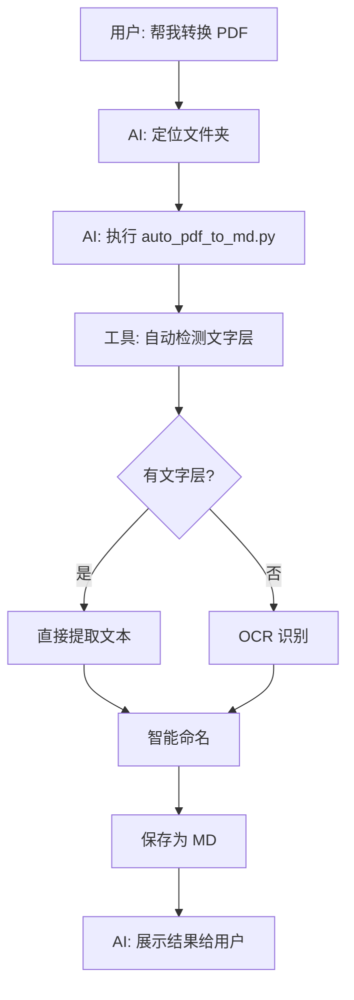

# 🤖 AI 使用指南 - Claude Code 直接调用

## 用户只需说一句话

用户只需要说：

```
"帮我把 D:\pdfs 下的所有 PDF 转换为 Markdown"
```

或

```
"把 WSJF 目录下的 PDF 转成 MD 文件，自动命名"
```

## AI 自动执行

### AI 要做的事（用户无感知）

```bash
# AI 执行命令
cd D:\code\WSJF
python scripts/ocr/auto_pdf_to_md.py D:\pdfs --backend auto
```

**AI 不需要问用户**：
- ✅ 是否有文字层？（自动检测）
- ✅ 用哪个 OCR？（智能选择）
- ✅ 怎么命名文件？（根据内容自动命名）
- ✅ PDF 太大怎么办？（自动处理）

**AI 只需展示结果**：
```
✅ 处理完成！共转换 15 个 PDF
  - 8 个有文字层（直接提取）
  - 7 个扫描件（OCR 识别）

📂 输出目录: D:\pdfs\markdown_output\
  ├── 需求文档_2025Q1.md
  ├── 产品方案_新零售.md
  ├── 技术架构设计.md
  └── ...

💰 OCR 额度消耗: 7 次（百度 OCR）
```

---

## AI 调用示例

### 示例对话 1

**用户**:
> 帮我把 D:\工作文档\需求PDF 下的 PDF 都转成 Markdown

**AI 回复**:
> 好的，我来帮你处理。
>
> *执行命令...*
>
> ✅ 完成！共处理 23 个 PDF：
> - 15 个有文字层（直接提取，不消耗 OCR）
> - 8 个扫描件（使用百度 OCR 识别）
>
> 📂 所有 Markdown 文件已保存到：
> `D:\工作文档\需求PDF\markdown_output\`
>
> 文件已根据内容自动命名，例如：
> - 2025年Q1产品需求规划.md
> - 用户增长方案_V2.md
> - 技术架构优化建议.md
>
> 💰 OCR 额度消耗：8 次（百度 OCR）
> 剩余额度：约 992 次

---

### 示例对话 2

**用户**:
> 我的 WSJF 项目根目录有些 PDF，帮我转成 MD

**AI 回复**:
> 好的，我先检查一下。
>
> *执行命令...*
>
> 在 `D:\code\WSJF\` 找到 5 个 PDF 文件。
>
> *自动处理...*
>
> ✅ 完成！
> - 5 个文件全部有文字层（直接提取，未消耗 OCR 额度）
>
> 📂 输出目录：`D:\code\WSJF\markdown_output\`
>   ├── WSJF方法论介绍.md
>   ├── 迭代排期指南.md
>   └── ...
>
> 💡 这些文件都有文字层，所以没有使用 OCR，零额度消耗！

---

### 示例对话 3：处理超大 PDF

**用户**:
> 有个 300 页的扫描 PDF，帮我转成 MD

**AI 回复**:
> 好的，这是一个大文件，我会自动分页处理。
>
> *执行命令...*
>
> 📄 检测到大 PDF：300 页
> 🤖 使用百度 OCR 逐页识别...
>
> [进度] 1/300... 50/300... 100/300... 200/300... 300/300
>
> ✅ 完成！（用时约 5 分钟）
>
> 📂 输出文件：`产品需求汇总_2025.md`
> - 总字符数：456,789
> - 总行数：12,345
>
> 💰 OCR 额度消耗：300 次（百度 OCR）
> 剩余额度：约 700 次

---

## AI 执行流程



---

## AI 命令模板

### 基本模板

```python
# AI 执行的命令
result = subprocess.run([
    'python',
    'scripts/ocr/auto_pdf_to_md.py',
    user_provided_folder_path,
    '--backend', 'auto'
], capture_output=True, text=True)

# 解析结果
if result.returncode == 0:
    ai_reply = f"✅ 完成！查看结果：{folder_path}/markdown_output/"
else:
    ai_reply = f"❌ 处理失败：{result.stderr}"
```

### 智能选择后端

```python
# 根据用户描述选择后端
if "中文" in user_message or "手写" in user_message:
    backend = "baidu"
elif "批量" in user_message or "大量" in user_message:
    backend = "ocrspace"
else:
    backend = "auto"

# 执行
subprocess.run([
    'python',
    'scripts/ocr/auto_pdf_to_md.py',
    folder_path,
    '--backend', backend
])
```

---

## 用户体验设计

### 用户说话方式（任意一种）

```
"帮我把 D:\pdfs 的 PDF 转成 Markdown"
"WSJF 目录下有 PDF，转成 MD"
"D:\工作文档 里的 PDF 需要识别成文本"
"批量处理 D:\扫描件 下的 PDF"
"把那些 PDF 都转成 Markdown，自动命名"
```

### AI 回复模板

**开始时**:
```
好的，我来帮你处理 D:\pdfs 下的 PDF 文件。

正在检测文件...
```

**处理中**:
```
找到 15 个 PDF 文件

[1/15] 文档1.pdf
  ✓ 有文字层，直接提取

[2/15] 扫描件2.pdf
  ℹ 无文字层，使用 OCR 识别...
  ✓ 完成

...
```

**完成时**:
```
✅ 全部完成！

处理结果：
- 总文件：15 个
- 有文字层：8 个（直接提取）
- 扫描件：7 个（OCR 识别）

📂 输出目录：D:\pdfs\markdown_output\

已生成的文件：
  ├── 2025年产品规划.md
  ├── 需求优先级分析_Q1.md
  ├── 技术方案设计.md
  └── ...

💰 OCR 额度消耗：7 次（百度 OCR）
   剩余额度：约 993 次
```

---

## 特殊场景处理

### 场景 1: 文件夹不存在

```
用户: 帮我转换 D:\不存在的文件夹\pdfs

AI 检测: 文件夹不存在
AI 回复:
  ❌ 文件夹不存在：D:\不存在的文件夹\pdfs

  请检查路径是否正确，或告诉我正确的路径。
```

### 场景 2: 没有 PDF 文件

```
用户: 转换 D:\空文件夹

AI 检测: 无 PDF 文件
AI 回复:
  ❌ 该文件夹中没有 PDF 文件

  已检查路径：D:\空文件夹
  支持格式：.pdf, .PDF
```

### 场景 3: 超大 PDF

```
用户: 转换这个 500 页的 PDF

AI 检测: 单个大文件
AI 回复:
  检测到大 PDF（500 页）

  正在自动分页处理...

  [进度] 50/500... 100/500... 500/500

  ✅ 完成！（用时 8 分钟）

  文件：超大文档合集.md
  字符数：892,345
```

---

## 高级功能（AI 可选使用）

### 1. 指定输出目录

```python
# 如果用户说"保存到 D:\输出"
subprocess.run([
    'python',
    'scripts/ocr/auto_pdf_to_md.py',
    'D:\\pdfs',
    '--output-dir', 'D:\\输出'
])
```

### 2. 静默模式

```python
# 如果只需要结果，不需要详细过程
subprocess.run([
    'python',
    'scripts/ocr/auto_pdf_to_md.py',
    folder_path,
    '--quiet'
])
```

### 3. 指定 OCR 后端

```python
# 如果用户特别说明"用百度"
backend = 'baidu'

# 如果用户说"批量"或"大量"
backend = 'ocrspace'  # 额度大

subprocess.run([
    'python',
    'scripts/ocr/auto_pdf_to_md.py',
    folder_path,
    '--backend', backend
])
```

---

## 返回信息格式

### 成功时返回

```json
{
  "status": "success",
  "total": 15,
  "has_text_layer": 8,
  "needs_ocr": 7,
  "success": 15,
  "failed": 0,
  "output_dir": "D:\\pdfs\\markdown_output",
  "files": [
    "需求文档_2025Q1.md",
    "产品方案_新零售.md",
    ...
  ],
  "ocr_usage": 7,
  "backend": "baidu"
}
```

### 失败时返回

```json
{
  "status": "error",
  "error": "文件夹不存在: D:\\不存在",
  "suggestion": "请检查路径是否正确"
}
```

---

## AI 提示词模板

当用户请求批量转换 PDF 时：

```
用户请求：{user_message}
检测到：批量 PDF 转换需求

执行步骤：
1. 提取文件夹路径
2. 判断使用哪个 OCR 后端（中文→baidu，其他→auto）
3. 执行：python scripts/ocr/auto_pdf_to_md.py {path} --backend {backend}
4. 解析输出
5. 友好地展示结果给用户

展示内容：
- 处理了多少文件
- 有几个直接提取，几个 OCR
- 输出目录在哪里
- 生成了哪些文件（列出文件名）
- OCR 额度消耗情况
```

---

## ✅ 总结

### 用户视角

```
用户只需要：
  1. 告诉 AI 文件夹路径
  2. 等待 AI 处理
  3. 查看结果

用户不需要：
  ❌ 了解 OCR 技术
  ❌ 选择工具
  ❌ 配置参数
  ❌ 处理错误
```

### AI 视角

```
AI 需要做：
  1. 解析用户意图
  2. 提取文件夹路径
  3. 执行 auto_pdf_to_md.py
  4. 展示友好的结果

AI 不需要：
  ❌ 询问技术细节
  ❌ 让用户选择参数
  ❌ 解释中间过程
```

---

**完美的用户体验**:
> "一句话需求 → AI 自动完成 → 展示结果" 🎯
